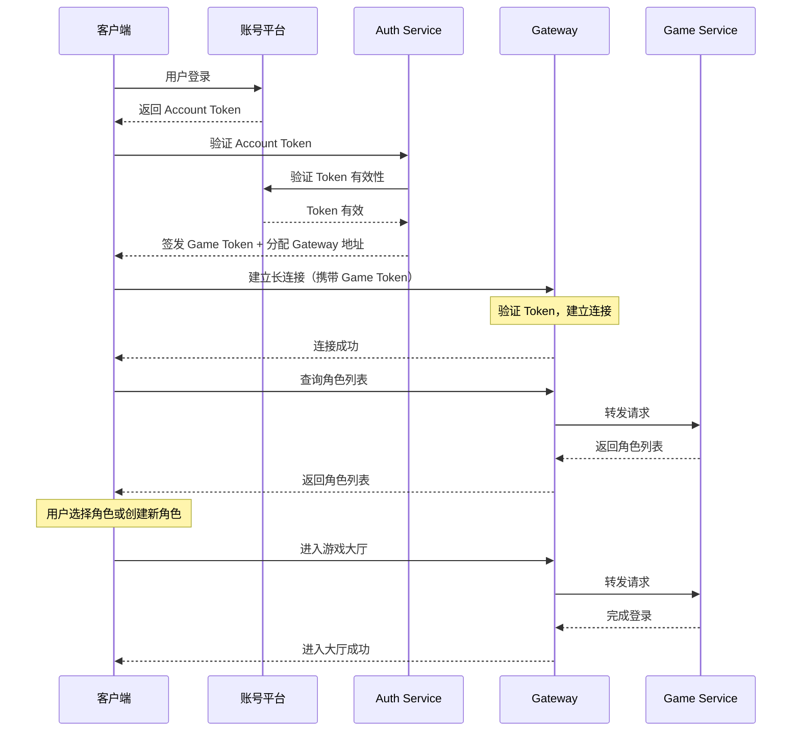
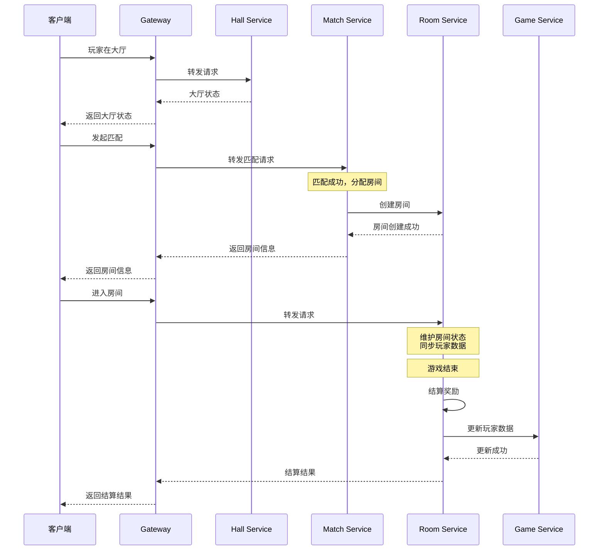
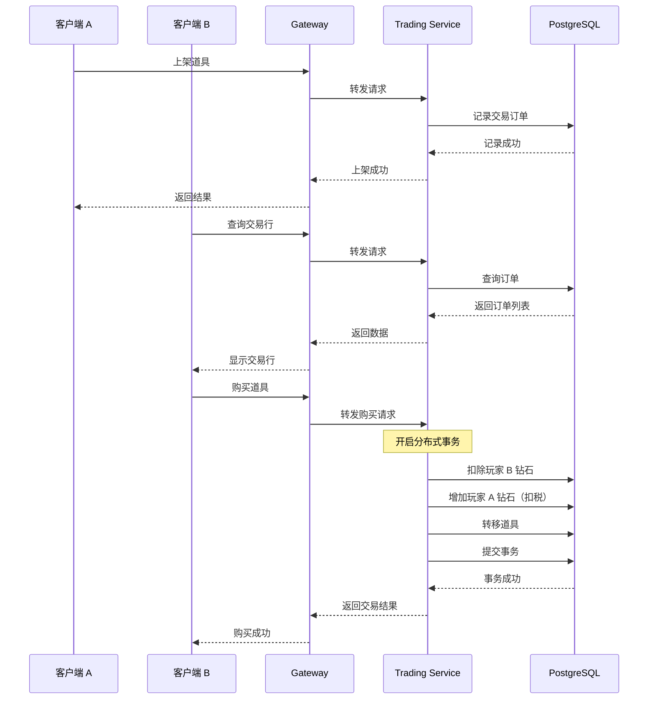
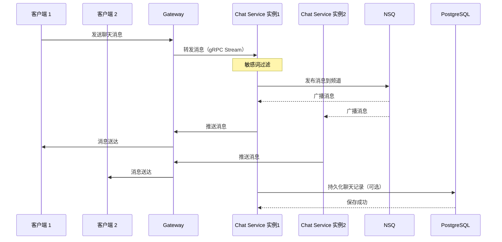

# 系统架构设计

## 概述

XStory 是一款多人在线游戏，采用微服务架构设计。本文档描述整体系统架构、服务划分、数据流、以及关键技术决策。

---

## 架构图

```
┌─────────────────────────────────────────────────────────────────┐
│                          客户端层                                  │
│  (Unity/Unreal Client, H5, 小程序)                               │
└────────────────────────────┬────────────────────────────────────┘
                             │ gRPC
                             ↓
┌─────────────────────────────────────────────────────────────────┐
│                      Gateway Service (网关)                       │
│  - 请求路由                                                        │
│  - 负载均衡                                                        │
│  - 限流熔断                                                        │
└────────────────────────────┬────────────────────────────────────┘
                             │
            ┌────────────────┼────────────────┐
            │                │                │
            ↓                ↓                ↓
┌──────────────────┐  ┌──────────────┐  ┌──────────────┐
│   Auth Service   │  │ Game Service │  │ Hall Service │
│   (认证服务)      │  │  (游戏服务)   │  │  (大厅服务)   │
└──────────────────┘  └──────────────┘  └──────────────┘
            │                │                │
            ↓                ↓                ↓
┌──────────────────┐  ┌──────────────┐  ┌──────────────┐
│  Match Service   │  │  Room Service│  │  Team Service│
│  (匹配服务)       │  │  (房间服务)   │  │  (组队服务)   │
└──────────────────┘  └──────────────┘  └──────────────┘
            │                │                │
            ↓                ↓                ↓
┌──────────────────┐  ┌──────────────┐  ┌──────────────┐
│  Friend Service  │  │  Guild Service│ │  Chat Service│
│  (好友服务)       │  │  (公会服务)   │  │  (聊天服务)   │
└──────────────────┘  └──────────────┘  └──────────────┘
            │                │                │
            ↓                ↓                ↓
┌──────────────────┐  ┌──────────────┐  ┌──────────────┐
│  Trading Service │  │  Home Service│  │  Doll Service│
│  (交易行服务)     │  │  (家园服务)   │  │  (玩偶服务)   │
└──────────────────┘  └──────────────┘  └──────────────┘
            │                │                │
            ↓                ↓                ↓
┌──────────────────┐  ┌──────────────┐
│   Rank Service   │  │  Mail Service│
│  (排行榜服务)     │  │  (邮件服务)   │
└──────────────────┘  └──────────────┘
            │                │
            └────────────────┴────────────────┐
                             │
                             ↓
┌─────────────────────────────────────────────────────────────────┐
│                         基础设施层                                │
│  ┌──────────┐  ┌────────┐  ┌──────┐  ┌──────────────────┐      │
│  │PostgreSQL│  │ Redis  │  │ NSQ  │  │ etcd (服务发现)   │      │
│  └──────────┘  └────────┘  └──────┘  └──────────────────┘      │
└─────────────────────────────────────────────────────────────────┘
            │
            ↓
┌─────────────────────────────────────────────────────────────────┐
│                         外部平台                                  │
│  - 账号平台 (Account Platform)                                   │
│  - GM 平台 (GM Platform)                                        │
│  - 第三方支付平台                                                │
│  - 第三方物流平台                                                │
└─────────────────────────────────────────────────────────────────┘
```

---

## 核心设计原则

### 1. 微服务架构
- 每个服务独立部署、独立扩展
- 服务间通过 gRPC 通信
- 清晰的服务边界和职责

### 2. 无状态服务优先
- 大部分服务设计为无状态，方便水平扩展
- 状态存储在 Redis 或 PostgreSQL
- 有状态服务（Hall、Room、Chat）使用共享存储

### 3. 高可用设计
- 服务多实例部署
- 通过 etcd 实现服务发现和健康检查
- 使用 Redis 集群和 PostgreSQL 主从复制

### 4. 异步解耦
- 使用消息队列（NSQ）处理异步任务
- 服务间通过事件通知解耦
- 提高系统吞吐量和响应速度

---

## 服务分层

### 接入层
- **Gateway Service**：统一入口，负责路由、负载均衡、限流

### 认证层
- **Auth Service**：账号认证、Token 管理

### 业务层

#### 核心玩法服务
- **Game Service**：游戏核心逻辑（关卡、玩家、背包、商店、任务、角色）
- **Hall Service**：大厅场景
- **Match Service**：匹配系统
- **Room Service**：游戏房间
- **Team Service**：组队系统

#### 社交服务
- **Friend Service**：好友系统
- **Guild Service**：公会系统
- **Chat Service**：聊天系统
- **Mail Service**：邮件系统

#### 经济系统
- **Trading Service**：交易行
- **Home Service**：家园系统
- **Doll Service**：玩偶系统（盲盒、融合、兑换）

#### 排行榜
- **Rank Service**：排行榜系统

### 基础设施层
- **PostgreSQL**：持久化存储
- **Redis**：缓存和实时数据
- **NSQ**：消息队列
- **etcd**：服务发现和配置中心

---

## 关键流程设计

### 1. 玩家登录流程



### 2. 进入房间流程



### 3. 交易流程



### 4. 聊天消息流程



---

## 数据存储设计

### PostgreSQL 存储内容

#### 账号和角色
- `accounts`：账号信息
- `roles`：角色信息
- `role_attributes`：角色属性

#### 游戏数据
- `players`：玩家数据
- `inventories`：背包道具
- `tasks`：任务数据
- `levels`：关卡配置

#### 社交数据
- `friends`：好友关系
- `guilds`：公会信息
- `guild_members`：公会成员
- `mails`：邮件数据

#### 经济数据
- `trading_orders`：交易订单
- `transactions`：交易流水
- `homes`：家园数据
- `dolls`：玩偶数据

### Redis 存储内容

#### 会话和状态
- `session:{player_id}`：玩家会话
- `online:{player_id}`：在线状态

#### 游戏状态
- `hall:{hall_id}`：大厅状态
- `room:{room_id}`：房间状态
- `team:{team_id}`：队伍信息

#### 匹配队列
- `match_queue:{mode}`：匹配队列

#### 排行榜
- `rank:{type}`：各类排行榜（Sorted Set）

#### 缓存
- `cache:player:{player_id}`：玩家信息缓存
- `cache:guild:{guild_id}`：公会信息缓存
- `cache:home:{player_id}`：家园状态缓存

---

## 服务通信

### gRPC 通信模式

#### Unary RPC（一元调用）
大部分服务间调用使用一元 RPC：
```protobuf
rpc GetPlayer(GetPlayerRequest) returns (GetPlayerResponse);
```

#### Server Streaming RPC（服务端流）
用于推送实时数据：
```protobuf
rpc WatchRoomState(WatchRoomRequest) returns (stream RoomState);
```

#### Client Streaming RPC（客户端流）
用于批量数据上传：
```protobuf
rpc BatchUploadActions(stream Action) returns (BatchResponse);
```

#### Bidirectional Streaming RPC（双向流）
用于聊天等实时交互：
```protobuf
rpc Chat(stream ChatMessage) returns (stream ChatMessage);
```

---

## 扩展性设计

### 水平扩展

#### 无状态服务（11个）
直接增加实例数量即可：
```bash
# 使用 Kubernetes 扩展
kubectl scale deployment game-service --replicas=5
```

#### 有状态服务（3个）

##### Hall Service
- 使用一致性哈希分配玩家到不同大厅实例
- 大厅状态存储在 Redis
- 实例间通过 Redis Pub/Sub 通信

##### Room Service
- 按房间 ID 一致性哈希分配
- 房间状态存储在 Redis
- 支持房间迁移（高级功能）

##### Chat Service
- 所有实例订阅 NSQ 消息
- 客户端建立长连接到任意实例
- 消息通过 NSQ 广播到所有实例

### 数据库扩展

#### PostgreSQL
- 主从复制（读写分离）
- 分库分表（按玩家 ID 分片）
- 使用连接池提高性能

#### Redis
- Redis Cluster（自动分片）
- 主从复制
- 哨兵模式（高可用）

---

## 服务发现与负载均衡

### etcd 服务注册

每个服务启动时注册到 etcd：
```go
// 服务注册示例
endpoint := endpoints.NewManager(etcdClient, "xstory/services/game")
endpoint.AddEndpoint(ctx, "game-instance-1", endpoints.Endpoint{
    Addr: "192.168.1.10:50051",
})
```

### gRPC 客户端负载均衡

```go
// 客户端通过 etcd resolver 自动发现服务
conn, err := grpc.Dial(
    "etcd:///xstory/services/game",
    grpc.WithResolvers(resolver),
    grpc.WithDefaultServiceConfig(`{"loadBalancingPolicy":"round_robin"}`),
)
```

---

## 容错和高可用

### 服务容错
- **超时控制**：所有 gRPC 调用设置超时
- **重试机制**：失败自动重试（幂等操作）
- **熔断器**：防止级联故障
- **降级策略**：核心功能优先保障

### 数据容错
- **PostgreSQL 主从复制**：主库故障自动切换
- **Redis 持久化**：AOF + RDB
- **定期备份**：数据库定期全量备份
- **消息队列持久化**：NSQ 消息持久化到磁盘

---

## 监控和运维

### 指标监控
- **Prometheus**：采集服务指标
  - QPS、延迟、错误率
  - 数据库连接数
  - Redis 命中率
  - 消息队列堆积

### 日志
- **结构化日志**：使用 Zap
- **日志聚合**：ELK Stack（Elasticsearch + Logstash + Kibana）
- **分布式追踪**：Jaeger

### 告警
- **Alertmanager**：告警管理
- **钉钉/企业微信**：告警通知

---

## 安全设计

### 认证和鉴权
- **JWT Token**：Game Token 有过期时间
- **Token 刷新**：支持 Refresh Token
- **权限校验**：每个接口验证玩家权限

### 数据安全
- **敏感数据加密**：密码、支付信息加密存储
- **SQL 注入防护**：使用参数化查询
- **XSS 防护**：输入验证和输出转义

### 防作弊
- **服务端验证**：所有关键逻辑在服务端
- **日志审计**：记录关键操作
- **异常检测**：识别异常行为

---

## Proto 仓库架构

### 独立的 Proto 仓库

#### xstory-proto-common
公共类型定义（所有仓库共用）

#### xstory-proto-api
客户端和服务端通信协议

#### xstory-proto-internal
服务端内部通信协议

### 依赖关系
```
xstory-proto-api → xstory-proto-common
xstory-proto-internal → xstory-proto-common
xstory (服务端) → xstory-proto-api + xstory-proto-internal
xstory-client (客户端) → xstory-proto-api
```

---

## 配置仓库

### xstory-config
策划表配置仓库：
- Excel 原始表格
- 导出的 JSON 配置
- 导表工具脚本

服务端启动时加载配置：
- 从 Git 拉取指定版本
- 或从 CDN 下载
- 支持热更新

---

## 外部平台对接

### 账号平台
- **自有账号系统**
- **第三方登录**：微信、QQ、Apple ID

### GM 平台
- 玩家数据管理
- 配置管理
- 运营工具
- 数据统计

### 支付平台
- 微信支付
- 支付宝

### 物流平台
- 玩偶兑换实体商品发货

---

## 部署架构

### 开发环境
```
Docker Compose：快速启动所有服务
```

### 测试环境
```
Kubernetes：模拟生产环境
```

### 生产环境
```
Kubernetes 集群：
- 多节点部署
- 自动扩缩容
- 滚动更新
- 健康检查
```

---

## 总结

XStory 采用现代微服务架构，具备以下特点：

✅ **高性能**：Go 语言 + gRPC + Redis
✅ **高可用**：服务多实例 + 数据备份
✅ **可扩展**：无状态服务 + 水平扩展
✅ **易维护**：服务边界清晰 + 统一技术栈
✅ **安全可靠**：认证鉴权 + 数据加密 + 防作弊

该架构可以支撑千万级用户规模，并具备持续演进的能力。
